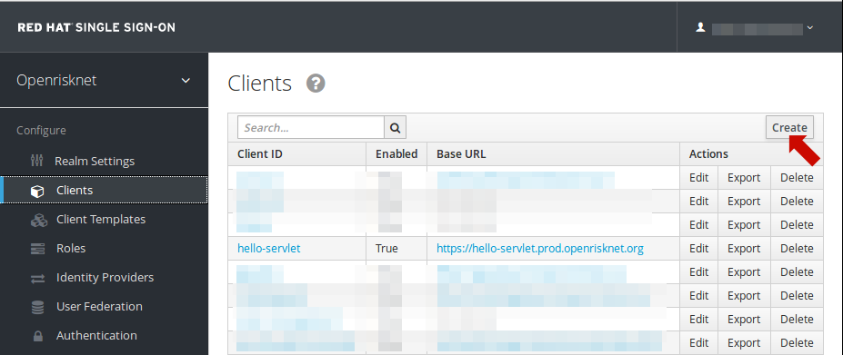
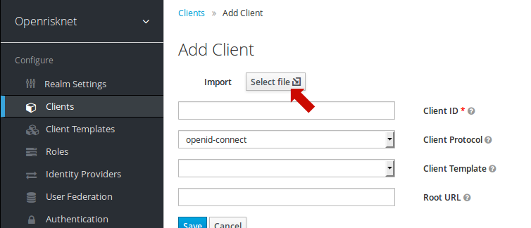
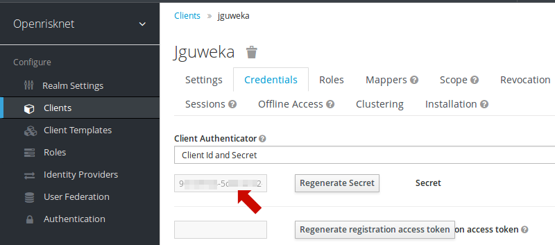

---
title Tomcat Keycloak Setup
order: 6
---
# Tomcat Keycloak Setup
This document describes Keycloak authentication setup for the JGU WEKA REST service running in docker tomcat environment.

tbc ...

## Manual Approach

### Define a new client in the SSO realm
* Login to the Redhat Single Sing-On interface and switch into the openrisknet realm. 
* Left hand menu click on Clients. 
* Click on the Create button  
 
* Import the client template [jguweka.json](../openshift/keycloak/jguweka.json)
 
* Press save and adjust the client settings, URLs, ...
* Save this again
* Switch to the Credentials tab and copy the 36 character long HexadecimalNumber credential.
  
* Set this credential as a value in [jguweka.json](../openshift/keycloak/keycloak.json)   
  example:  
  ```
    "credentials" : {
      "secret": "123456789-abcd-abcd-abcd-1234567890ab"
    },
  ``` 
  
